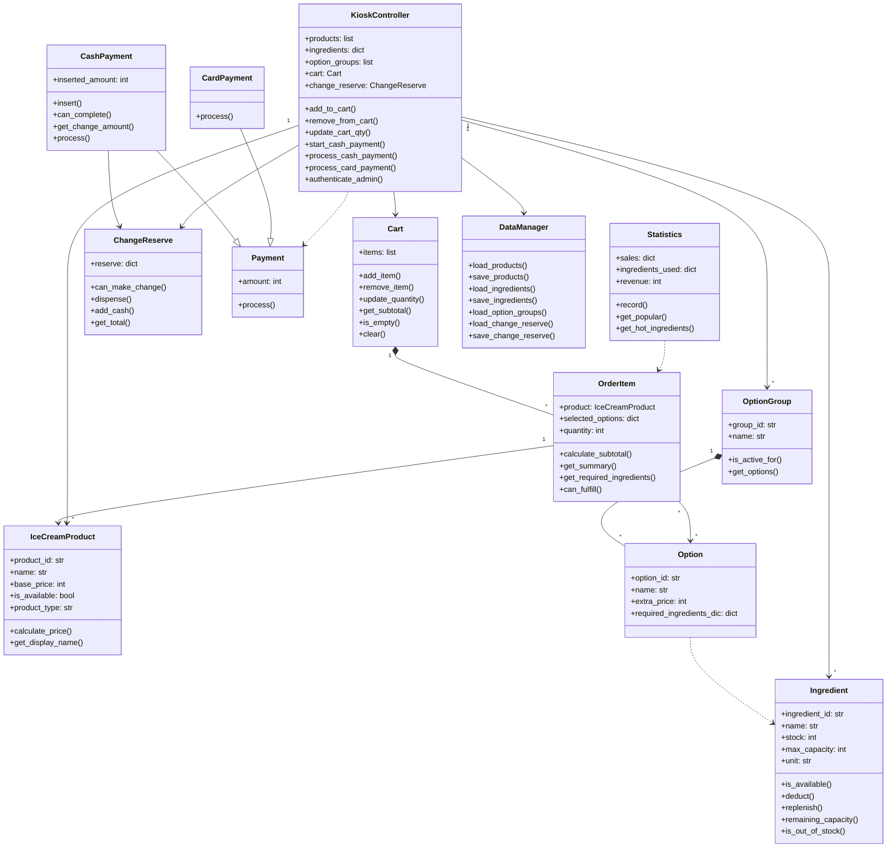

```mermaid
classDiagram

class IceCreamProduct {
    +product_id: str
    +name: str
    +base_price: int
    +is_available: bool
    +product_type: str
    +calculate_price()
    +get_display_name()
}

class Ingredient {
    +ingredient_id: str
    +name: str
    +stock: int
    +max_capacity: int
    +unit: str
    +is_available()
    +deduct()
    +replenish()
    +remaining_capacity()
    +is_out_of_stock()
}

class Option {
    +option_id: str
    +name: str
    +extra_price: int
    +required_ingredients_dic: dict
}

class OptionGroup {
    +group_id: str
    +name: str
    +is_active_for()
    +get_options()
}

class OrderItem {
    +product: IceCreamProduct
    +selected_options: dict
    +quantity: int
    +calculate_subtotal()
    +get_summary()
    +get_required_ingredients()
    +can_fulfill()
}

class Cart {
    +items: list
    +add_item()
    +remove_item()
    +update_quantity()
    +get_subtotal()
    +is_empty()
    +clear()
}

class ChangeReserve {
    +reserve: dict
    +can_make_change()
    +dispense()
    +add_cash()
    +get_total()
}

class Payment {
    +amount: int
    +process()
}

class CashPayment {
    +inserted_amount: int
    +insert()
    +can_complete()
    +get_change_amount()
    +process()
}

class CardPayment {
    +process()
}

class Statistics {
    +sales: dict
    +ingredients_used: dict
    +revenue: int
    +record()
    +get_popular()
    +get_hot_ingredients()
}

class DataManager {
    +load_products()
    +save_products()
    +load_ingredients()
    +save_ingredients()
    +load_option_groups()
    +load_change_reserve()
    +save_change_reserve()
}

class KioskController {
    +products: list
    +ingredients: dict
    +option_groups: list
    +cart: Cart
    +change_reserve: ChangeReserve

    +add_to_cart()
    +remove_from_cart()
    +update_cart_qty()

    +start_cash_payment()
    +process_cash_payment()
    +process_card_payment()

    +authenticate_admin()
}

OptionGroup "1" *-- "*" Option

Cart "1" *-- "*" OrderItem

OrderItem "1" --> "1" IceCreamProduct
OrderItem "*" --> "*" Option

Option ..> Ingredient

CashPayment --|> Payment
CardPayment --|> Payment

CashPayment --> ChangeReserve

KioskController --> Cart
KioskController --> ChangeReserve
KioskController --> DataManager

KioskController "1" --> "*" IceCreamProduct
KioskController "1" --> "*" Ingredient
KioskController "1" --> "*" OptionGroup

KioskController ..> Payment

Statistics ..> OrderItem
```
