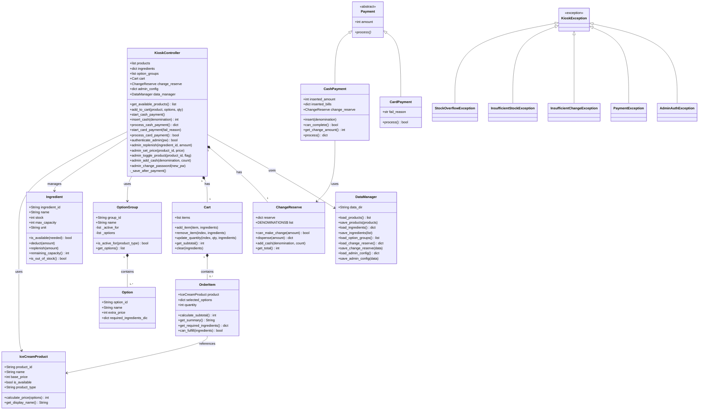
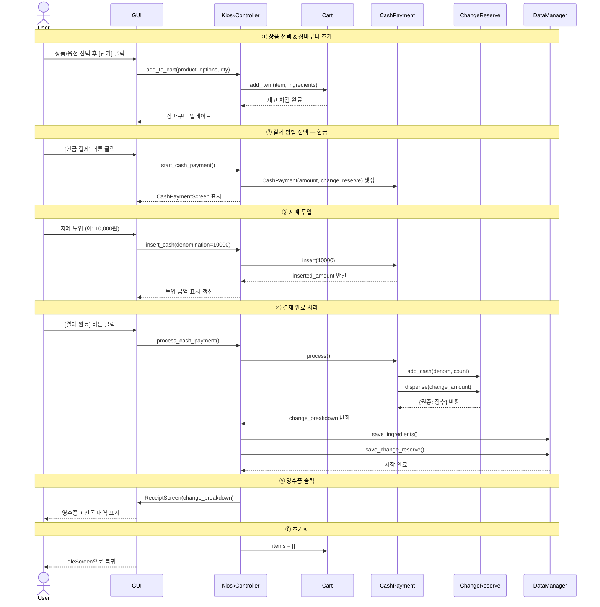
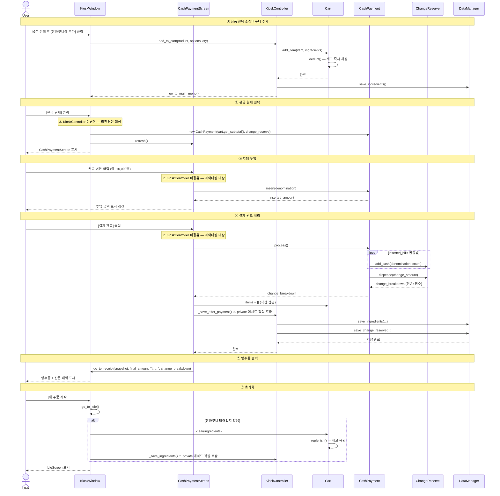

# 아이스크림 키오스크 — UML 다이어그램

## 클래스 다이어그램

## 시퀀스 다이어그램 — 의도한 아키텍처

---

## 시퀀스 다이어그램 — 실제 코드 기준

> ⚠️ 표시는 KioskController를 경유하지 않는 리팩터링 대상 경로.

| 구간 | 실제 경로 | 의도한 경로 |
|------|----------|------------|
| ② 결제 생성 | `KioskWindow`가 `CashPayment` 직접 생성 | `KC.start_cash_payment()` |
| ③ 지폐 투입 | `CashPaymentScreen`이 `CashPayment.insert()` 직접 호출 | `KC.insert_cash(denomination)` |
| ④ 결제 처리 | `CashPaymentScreen`이 `CashPayment.process()` 직접 호출 | `KC.process_cash_payment()` |
