# 시퀀스 다이어그램 — 현금 결제 전체 흐름

> 실제 코드 기준. ⚠️ 표시는 KioskController를 경유하지 않는 리팩터링 대상 경로.

```mermaid
sequenceDiagram
    actor User
    participant GW as KioskWindow
    participant CS as CashPaymentScreen
    participant KC as KioskController
    participant Cart
    participant CP as CashPayment
    participant CR as ChangeReserve
    participant DM as DataManager

    rect rgb(30, 50, 70)
        Note over User,DM: ① 상품 선택 & 장바구니 추가
        User->>GW: 옵션 선택 후 [장바구니에 추가] 클릭
        GW->>KC: add_to_cart(product, options, qty)
        KC->>Cart: add_item(item, ingredients)
        Cart->>Cart: deduct() — 재고 즉시 차감
        Cart-->>KC: 완료
        KC->>DM: save_ingredients()
        KC-->>GW: go_to_main_menu()
    end

    rect rgb(30, 50, 70)
        Note over User,DM: ② 현금 결제 선택
        User->>GW: [현금 결제] 클릭
        Note over GW: ⚠️ KioskController 미경유 — 리팩터링 대상
        GW->>CP: new CashPayment(cart.get_subtotal(), change_reserve)
        GW->>CS: refresh()
        GW-->>User: CashPaymentScreen 표시
    end

    rect rgb(30, 50, 70)
        Note over User,DM: ③ 지폐 투입
        User->>CS: 권종 버튼 클릭 (예: 10,000원)
        Note over CS: ⚠️ KioskController 미경유 — 리팩터링 대상
        CS->>CP: insert(denomination)
        CP-->>CS: inserted_amount
        CS-->>User: 투입 금액 표시 갱신
    end

    rect rgb(30, 50, 70)
        Note over User,DM: ④ 결제 완료 처리
        User->>CS: [결제 완료] 클릭
        Note over CS: ⚠️ KioskController 미경유 — 리팩터링 대상
        CS->>CP: process()
        loop inserted_bills 권종별
            CP->>CR: add_cash(denomination, count)
        end
        CP->>CR: dispense(change_amount)
        CR-->>CP: change_breakdown {권종: 장수}
        CP-->>CS: change_breakdown
        CS->>Cart: items = [] (직접 접근)
        CS->>KC: _save_after_payment() ⚠️ private 메서드 직접 호출
        KC->>DM: save_ingredients(...)
        KC->>DM: save_change_reserve(...)
        DM-->>KC: 저장 완료
        KC-->>CS: 완료
    end

    rect rgb(30, 50, 70)
        Note over User,DM: ⑤ 영수증 출력
        CS->>GW: go_to_receipt(snapshot, final_amount, "현금", change_breakdown)
        GW-->>User: 영수증 + 잔돈 내역 표시
    end

    rect rgb(30, 50, 70)
        Note over User,DM: ⑥ 초기화
        User->>GW: [새 주문 시작]
        GW->>GW: go_to_idle()
        alt 장바구니 비어있지 않음
            GW->>Cart: clear(ingredients)
            Cart->>Cart: replenish() — 재고 복원
            GW->>KC: _save_ingredients() ⚠️ private 메서드 직접 호출
        end
        GW-->>User: IdleScreen 표시
    end
```

## 아키텍처 메모

| 구간 | 실제 경로 | 의도한 경로 |
|------|----------|------------|
| ② 결제 생성 | `KioskWindow`가 `CashPayment` 직접 생성 | `KC.start_cash_payment()` |
| ③ 지폐 투입 | `CashPaymentScreen`이 `CashPayment.insert()` 직접 호출 | `KC.insert_cash(denomination)` |
| ④ 결제 처리 | `CashPaymentScreen`이 `CashPayment.process()` 직접 호출 | `KC.process_cash_payment()` |

`KioskController`에 해당 메서드(`start_cash_payment`, `insert_cash`, `process_cash_payment`)가 이미 정의되어 있음.
`main_window.py`와 `cash_payment.py` 두 파일 수정으로 의도한 단방향 의존 구조 완성 가능.
